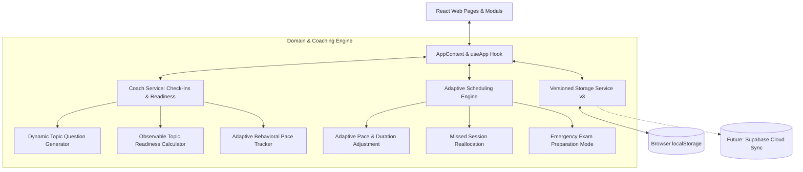

# Academic Coach Implementation Plan — My Academia Buddy

**Project:** My Academia Buddy — Adaptive Academic Coaching Platform  
**Target Branch:** `feature/academic-coach` (branched from validated `feature/academia-buddy-v2`)  
**Architectural Paradigm:** Clean Architecture + Local-First Reactive State + Adaptive Heuristic Engine  
**Date:** October 2026  

---

## 1. Executive Vision & Core Promise

> *"Your personal academic coach that knows what you need to study, when you need to study it, and how your plan should change when life gets in the way."*

My Academia Buddy is evolving from a static scheduling utility into an **adaptive academic organization coach**. The application does not act as an AI tutor that explains academic subjects; instead, it is a persistent academic companion that:
1. Understands each student's semester workload, employment schedule, and commitments.
2. Tracks progress at the **individual topic and chapter level** (attending lectures, finishing readings, practicing, reviewing).
3. Conducts personalized **weekly academic check-ins** asking concrete questions about specific courses and syllabus topics.
4. Evolves an **adaptive behavioral profile** based on observed completion rates, actual study speed, and repeated postponements without using punitive or judgmental labels.
5. Continuously recalibrates an **explainable, deterministic study plan**, offering automatic rescheduling for missed sessions and an emergency preparation mode for upcoming exams.

---

## 2. Current Baseline Audit (from `feature/academia-buddy-v2`)

| Component / Service | Current State | Adaptation for Academic Coach |
| :--- | :--- | :--- |
| **Data Persistence (`storage.js`)** | Versioned localStorage (v2) storing courses, assignments, exams, availability, studyPlan, studyInsights. | Upgrade schema to **v3** to persist `studentProfile`, `syllabusTopics`, `checkIns`, and `adaptiveSignals`. Backward compatible migration. |
| **Scheduling Engine (`scheduler.js`)** | Pure heuristic scheduler ranking tasks by urgency, priority, difficulty, workload, and spacing penalties. | Extend with **topic-level task generation**, **adaptive pace multiplier** ($1.0\times - 1.5\times$), **auto-rescheduling** for missed topics, and **emergency exam mode**. |
| **State Management (`AppContext.jsx`)** | Reactive React Context with centralized CRUD dispatchers and toast notifications. | Integrate coach state: `profile`, `updateProfile`, `topics`, `updateTopicProgress`, `checkIns`, `submitCheckIn`, `adaptiveSignals`. |
| **Dashboard (`Dashboard.jsx`)** | Metric counters, spotlight card, course workload breakdown, upcoming deadlines. | Redesign around coach coaching: **"What should I do today?"**, coach recommendation banner, weekly check-in call-to-action, topic readiness gauges. |
| **Courses View (`Courses.jsx`)** | Course cards with difficulty, instructor, schedule, color tags, and linked task counts. | Expand course model with **syllabus weekly topics**, required readings, and topic progress tracker. |
| **Automated Testing Suite** | 27 tests in Vitest covering storage, scheduler, context, and UI components. | Add test suites for check-in generation, topic progress calculations, adaptive profile updates, and missed session rescheduling. |

---

## 3. Data Model Specification (Schema v3)

### 3.1 Student Profile (`studentProfile`)
```typescript
interface StudentProfile {
  program: string;              // e.g. "Software Engineering"
  semester: string;             // e.g. "Year 2, Fall Term"
  organizationLevel: string;    // "Building Habits" | "Moderately Organized" | "Highly Structured"
  preferredStudyPeriods: string[]; // ["morning", "afternoon", "evening"]
  weeklyWorkHours: number;      // e.g. 15 hours/week part-time
  workScheduleSummary: string;  // e.g. "Tue/Thu evenings, Sat morning"
  recurringCommitments: string[]; // ["Club meeting Wed 18:00", "Commute 45m"]
  weeklyStudyGoalHours: number; // e.g. 20 hours
  academicGoal: string;         // e.g. "Maintain 3.7 GPA & balance work"
  preferredLanguage: string;    // "en" | "fr"
  onboardingCompleted: boolean;
}
```

### 3.2 Syllabus Topics (`syllabusTopics`)
```typescript
interface SyllabusTopic {
  id: string;                   // e.g. "topic-seg2105-w1"
  courseId: number;             // references Course.id
  courseName: string;           // e.g. "SEG2105"
  weekNumber: number;           // 1 to 14
  title: string;                // e.g. "Object-Oriented Architecture & UML"
  description: string;
  requiredReadings: string;     // e.g. "Chapter 3, pages 45-72"
  practiceProblems: string;     // e.g. "Exercise set 2.1 to 2.4"
  estimatedHours: number;       // e.g. 3.5 hours
  prerequisiteTopicIds: string[]; // topic dependencies
  // Topic progress status
  status: "not_started" | "attended_lecture" | "reading_completed" | "practiced" | "reviewed";
  confidence: number;           // 1 (low) to 5 (high)
  lastUpdated: string;          // ISO timestamp
}
```

### 3.3 Weekly Academic Check-Ins (`checkIns`)
```typescript
interface WeeklyCheckIn {
  id: string;                   // e.g. "checkin-2026-w41"
  weekNumber: number;
  date: string;                 // ISO date
  responses: Array<{
    topicId: string;
    courseName: string;
    topicTitle: string;
    questionText: string;
    answer: "completed" | "partially_completed" | "not_started" | "skipped" | "not_applicable" | "unsure";
    confidenceScore: number;    // 1 to 5
    notes?: string;
  }>;
  newCommitmentsNoted?: string;
  completedAt: string;
}
```

### 3.4 Adaptive Signals & Profile (`adaptiveSignals`)
```typescript
interface AdaptiveSignals {
  completionRate: number;       // % of scheduled sessions completed
  paceMultiplier: number;       // 1.0 = on schedule, >1.0 = needs more time (e.g. 1.25x)
  missedSessionsCount: number;
  postponementCount: number;
  preferredSessionDuration: number; // e.g. 45 min vs 75 min
  observedVelocityByCourse: Record<string, number>; // courseName -> multiplier
  lastRecalibrationDate: string;
  coachInsight: string;         // supportive, non-punitive adaptive coaching message
}
```

---

## 4. Architectural Component Architecture



---

## 5. Phased Implementation Roadmap

### Phase 1: Core Vertical Slice (Current Milestone)
1. **Student Onboarding Experience (`src/pages/Onboarding.jsx`):**
   - Multi-step, supportive wizard collecting academic program, work commitments, preferred study periods, and goals.
   - Non-judgmental, skippable, and fully editable from a Coach Profile modal.
2. **Syllabus & Topic Management (`src/pages/Courses.jsx` & Data Models):**
   - Topic-level curriculum breakdown for each course (week number, topic title, readings, exercises, estimated workload).
   - Topic status toggles (`not_started`, `attended_lecture`, `reading_completed`, `practiced`, `reviewed`) with 1–5 confidence ratings.
3. **Personalized Weekly Academic Check-In (`src/pages/CheckIn.jsx`):**
   - Generates contextual questions about current week's topics and lectures.
   - 2-minute completion experience with answers: `Completed`, `Partially completed`, `Not started`, `Skipped`, `Unsure`.
4. **Adaptive Engine & Readiness Calculator (`src/services/coach.js`):**
   - Calculates transparent course preparation readiness based on observable progress.
   - Computes adaptive pace multiplier from actual check-in answers without punitive labels.
5. **Adaptive Study Planner Extension (`src/services/scheduler.js`):**
   - Generates concrete, granular action steps (e.g., "Concept review: 30m → Practice exercises: 45m → Self-quiz: 15m").
   - Implements **Automatic Rescheduling** for missed or partially completed topics.
   - Implements **Emergency Exam Prep Mode** for imminent exams.
6. **Redesigned Academic Coach Dashboard (`src/pages/Dashboard.jsx`):**
   - Highlights **"What should I do today?"** daily agenda.
   - Displays coach advice banner, check-in status prompt, and course readiness meters.
7. **Automated Testing Suite Expansion:**
   - Unit tests for check-in question generation, adaptive signals, topic readiness, and automated rescheduling.

### Phase 2: Deferred Future Enhancements (Documented in Roadmap)
- **PDF Syllabus Import & Parsing:** Rule-based parser extracting course codes, dates, and topics from syllabus PDFs with a mandatory review-and-correct wizard.
- **Progressive Web App (PWA):** Service worker, manifest, and offline caching for installable home screen experience.
- **Backend Architecture & Scheduled Notifications:** Supabase database migration, user authentication, and scheduled email reminders via serverless edge functions.

---

## 6. Technical Integrity & Safety Rules
- **No breaking changes:** Existing course, assignment, exam, and availability data will be seamlessly migrated to schema v3.
- **All tests passing:** The baseline 27 tests must continue passing, accompanied by new comprehensive test suites.
- **Zero external paid dependencies:** The coaching system uses deterministic, transparent algorithms without paid LLM API keys.
- **Git Safety:** Development strictly isolated on `feature/academic-coach`.
