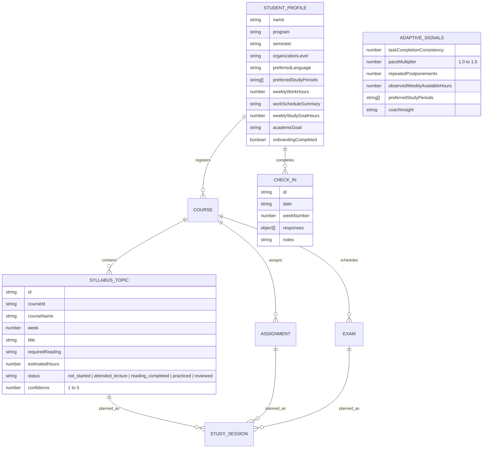
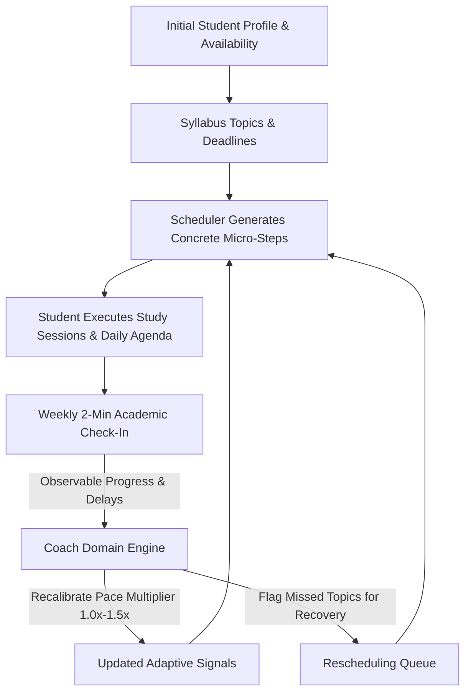

# System Architecture — Adaptive Academic Coaching Platform

## 1. Architectural Philosophy

My Academia Buddy is architected around the promise:  
> *"Your personal academic coach that knows what you need to study, when you need to study it, and how your plan should change when life gets in the way."*

To deliver on this promise without expensive or opaque third-party AI dependencies, the architecture adheres to:
1. **Separation of Concerns:** Pure domain logic (the deterministic heuristic scheduler and the adaptive coaching recalibrator) are 100% decoupled from web presentation components.
2. **Explainability & Transparency:** Every session scheduled and every readiness score calculated is 100% explainable through transparent heuristics. Readiness is never misrepresented as a scientific passing probability.
3. **Adaptive Feedback Loop:** The system adapts its scheduling assumptions (e.g. pace multiplier, available hours, buffer intervals) to observable student behavior through weekly check-ins and session completions.
4. **Resilience & Privacy-First Persistence:** Works completely client-side in offline-first mode with safe storage fallbacks and automated migrations.

---

## 2. Directory Structure & Responsibilities

```
src/
├── context/                   # Global reactive state management
│   ├── AppContext.jsx         # AppProvider implementation & coach operations
│   ├── AppContextDefinition.js# Isolated Context definition (Fast Refresh compliant)
│   ├── useApp.js              # Custom consumer hook
│   └── index.js               # Module re-exports
│
├── services/                  # Pure domain logic & persistence engines
│   ├── coach.js               # Domain Coaching Engine: check-in generation,
│   │                          # readiness scores, pace recalibration, missed topics
│   ├── scheduler.js           # Multi-factor heuristic study planner:
│   │                          # granular 3-step micro-actions, emergency exam mode,
│   │                          # adaptive pace buffer, deadline decay scoring
│   └── storage.js             # Safe localStorage persistence, migrations (v1 → v3),
│                              # JSON backup/restore, and default CS demo seed
│
├── components/                # Reusable, accessible UI components
│   ├── Badge.jsx              # Priority, difficulty, and status badges
│   ├── CheckInModal.jsx       # 2-minute interactive weekly academic check-in
│   ├── ProfileModal.jsx       # Student profile & observed adaptive signals viewer
│   ├── OnboardingModal.jsx    # Non-judgmental 3-step semester onboarding wizard
│   ├── DataModal.jsx          # Backup, JSON restore, sample dataset modal
│   ├── Header.jsx             # Sticky header with weekly check-in & profile actions
│   ├── Modal.jsx              # Accessible dialog modal (keyboard navigable)
│   ├── Sidebar.jsx            # Navigation sidebar with coach shortcuts & status
│   └── ToastContainer.jsx     # Non-blocking floating notification queue
│
├── pages/                     # Route-level page views
│   ├── Dashboard.jsx          # Academic health overview, "What should I do today?"
│   │                          # daily agenda, observable readiness meters, coach banner
│   ├── Courses.jsx            # Course registration, weekly syllabus topics accordion,
│   │                          # topic status/confidence controls, syllabus import preview
│   ├── Assignments.jsx        # Deliverable tracking, workload hours, filters & sorting
│   ├── Exams.jsx              # Midterm and final scheduling with prep workloads
│   └── StudyPlanner.jsx       # Flagship planner: emergency exam mode, concrete micro-steps,
│                              # availability slots, timeline and explainability views
│
└── test/                      # Automated test suites (Vitest + React Testing Library)
    ├── setup.js               # Vitest environment setup & localStorage mock
    ├── smoke.test.js          # Testing baseline
    ├── storage.test.js        # Persistence, migration & backup tests
    ├── coach.test.js          # Question generation, readiness, adaptive signals
    ├── scheduler.test.js      # Micro-step breakdown, pace buffer, emergency mode
    ├── context.test.jsx       # Reactive state management tests
    └── components.test.jsx    # Component integration tests
```

---

## 3. Data Model Schema (Storage Schema v3)



---

## 4. Adaptive Coaching Feedback Loop



---

## 5. Backend, Cloud, & Security Architecture Proposal

To transition smoothly from local `localStorage` to multi-device synchronization without breaking the existing product:

### 5.1 Recommended Platform: Supabase (Affordable, Open-Source Firebase Alternative)
- **Authentication:** Supabase Auth (Email magic links or Google OAuth). Enables passwordless, secure student login.
- **Relational Database:** PostgreSQL with JSONB columns matching Schema v3.
- **Row-Level Security (RLS):** Every row in `courses`, `topics`, `assignments`, and `check_ins` is secured with:
  ```sql
  ALTER TABLE syllabus_topics ENABLE ROW LEVEL SECURITY;
  CREATE POLICY "Students can only access own topics" 
  ON syllabus_topics FOR ALL 
  USING (auth.uid() = user_id);
  ```
- **Student Data Privacy:** Academic syllabi and grades are stored strictly inside the user's RLS boundary. No student data is sent to external LLM APIs.

### 5.2 Scheduled Reminders Architecture (Check-Ins & Deadlines)
- **The Problem:** A browser-only SPA in `localStorage` cannot send emails or push notifications when closed.
- **Backend Architecture:**
  1. **PostgreSQL pg_cron / Edge Function:** Runs daily at midnight UTC to check for pending assignments due within 48h and students due for weekly check-ins.
  2. **Transactional Email Service:** Resend or SendGrid (free tiers support 3,000 emails/month).
  3. **Direct Authenticated Magic Links:** Emails contain secure deep links:
     `https://academia-buddy.app/check-in?token=...` taking the student directly to their 2-minute check-in view.
  4. **Quiet Hours & Opt-Out Preferences:** User controls notification frequency and quiet hours directly in their profile.

---

## 6. Mobile & PWA Evolution

- **Progressive Web App (PWA):** `manifest.json` and service worker caching strategy (`workbox-precaching` or Vite PWA plugin) can be added to enable desktop and mobile "Add to Home Screen".
- **React Native / Expo Portability:**
  Because all coaching heuristics (`src/services/coach.js`) and scheduling logic (`src/services/scheduler.js`) are pure JavaScript modules with zero DOM dependencies, they can be shared directly with a future Expo / React Native project in a shared `/packages/core` workspace.
