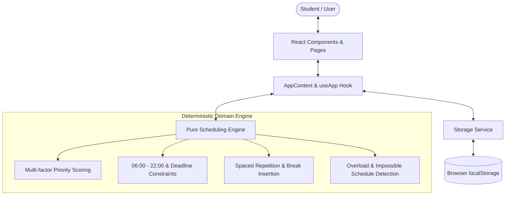

# System Architecture — My Academia Buddy 2.0

## 1. Architectural Philosophy

My Academia Buddy 2.0 is designed following **Clean Architecture** principles adapted for modern React applications. The primary goals are:
- **Separation of Concerns:** Pure business logic (the scheduling engine) is completely decoupled from UI presentation components.
- **Resilience & Fault Tolerance:** Storage failures, malformed data, and edge-case schedules never crash the application.
- **Determinism & Explainability:** Every algorithmic decision can be traced, tested, and explained to the user without relying on opaque machine learning models or third-party paid APIs.
- **Accessibility & Maintainability:** Built with standard web technologies (React 19, Vite 8, pure Vanilla CSS) with zero bloated UI libraries.

---

## 2. Directory Structure & Responsibilities

```
src/
├── context/               # Global state management & action dispatchers
│   ├── AppContext.jsx     # AppProvider implementation & reactive storage hooks
│   ├── AppContextDefinition.js # Isolated Context definition (Fast Refresh compliant)
│   ├── useApp.js          # Custom consumer hook
│   └── index.js           # Module re-exports
│
├── services/              # Pure domain logic & storage abstractions
│   ├── scheduler.js       # Heuristic scheduling engine & date utilities
│   └── storage.js         # Safe localStorage persistence, migrations, and backups
│
├── components/            # Reusable, accessible UI components
│   ├── Badge.jsx          # Priority, difficulty, and status badges
│   ├── DataModal.jsx      # Backup, JSON restore, sample dataset modal
│   ├── Header.jsx         # Sticky application header & mobile navigation toggle
│   ├── Modal.jsx          # Accessible dialog modal (keyboard navigable)
│   ├── Sidebar.jsx        # Responsive navigation sidebar & badge counters
│   └── ToastContainer.jsx # Non-blocking floating notification queue
│
├── pages/                 # Route-level page views
│   ├── Dashboard.jsx      # Academic health overview, spotlight session, workload
│   ├── Courses.jsx        # Course registration, difficulty tiers, progress tracking
│   ├── Assignments.jsx    # Deliverable tracking, workload hours, filters & sorting
│   ├── Exams.jsx          # Midterm and final scheduling with prep workloads
│   └── StudyPlanner.jsx   # Flagship planner: availability, views, explainability
│
├── test/                  # Automated test suites (Vitest + React Testing Library)
│   ├── setup.js           # Vitest environment setup & localStorage mock
│   ├── smoke.test.js      # Testing baseline
│   ├── storage.test.js    # Persistence, migration & backup tests
│   ├── scheduler.test.js  # Pure algorithmic constraints & scoring tests
│   ├── context.test.jsx   # Reactive state management tests
│   └── components.test.jsx# Component integration tests
│
├── App.jsx                # Application shell, routing, and provider wrapping
├── App.css                # Productivity SaaS design system stylesheet
├── index.css              # Global tokens, reset, typography, and focus styles
└── main.jsx               # React DOM entry point
```

---

## 3. High-Level Data Flow



---

## 4. Scheduling Engine Design

### 4.1 Heuristic Scoring Formula
For each available time window on `sessionDate`, eligible tasks are ranked using dynamic multi-factor scoring:

$$\text{Score} = \text{Urgency} + \text{Priority} + \text{Difficulty} + \text{Workload} + \text{ExamBonus} - \text{DailyPenalty} - \text{FairnessPenalty}$$

1. **Urgency Score:** Exponential urgency decay as the deadline nears:
   - Due today ($\le 0$ days): $+15$
   - 1 day away: $+12$
   - 2 days away: $+10$
   - 3–4 days: $+8$
   - 5–7 days: $+6$
   - 8–14 days: $+3$
   - $>14$ days: $+1$
2. **Priority Score:** Explicit student-defined weighting:
   - High: $+10.5$
   - Medium: $+7.0$
   - Low: $+3.5$
3. **Difficulty Tier:**
   - High: $+4.5$
   - Medium: $+3.0$
   - Low: $+1.5$
4. **Workload Weight:** $+1.5$ to $+4.5$ based on total required preparation hours.
5. **Fixed Exam Bonus:** $+3.0$ to ensure midterm/final reviews are scheduled early.
6. **Same-Day Repetition Penalty:** $-4.0 \times \text{dailySessions}$ (discourages cramming all sessions into one day and promotes spaced repetition).
7. **Fairness Penalty:** $-1.5 \times \text{totalSessions}$ (prevents a single high-priority project from starving other urgent coursework).

### 4.2 Hard Constraints
* **Availability Window:** Sessions are only scheduled during user-defined availability slots.
* **Permitted Hours:** Sessions are strictly clamped between **06:00 and 22:00**. Any nocturnal hours entered are disregarded to encourage healthy sleep habits.
* **Deadline Cutoff:** Sessions are never scheduled after the task's deadline date.
* **Cognitive Breaks:** A 15-minute rest interval is automatically scheduled between consecutive learning blocks.
* **Preservation of Completed Work:** When regenerating plans, sessions previously flagged as `completed` are locked in place and subtracted from remaining workload.

---

## 5. Security & Data Privacy

* **Zero Tracking / Zero Telemetry:** The application operates entirely client-side.
* **No External API Keys:** No sensitive credentials or paid LLM tokens are bundled or exposed.
* **Resilient Data Backup:** Students can export and import their full academic workspace via structured JSON backups at any time.
